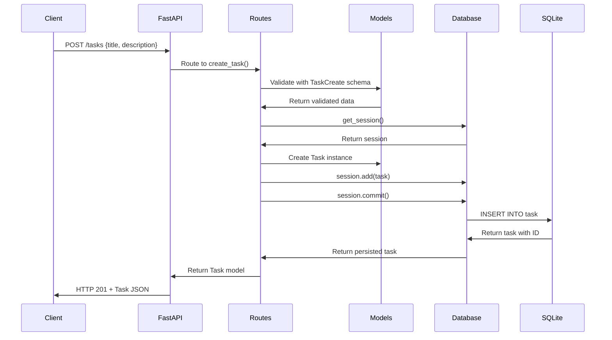
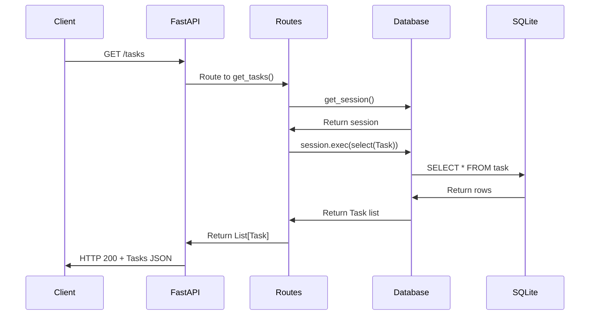
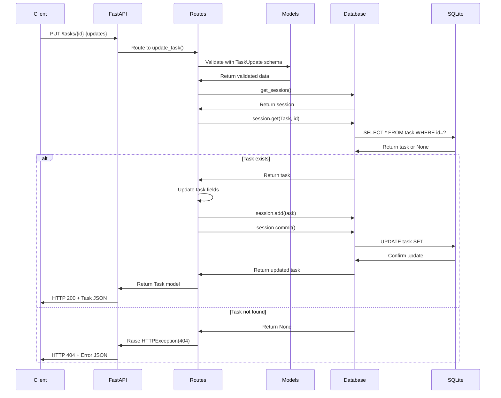
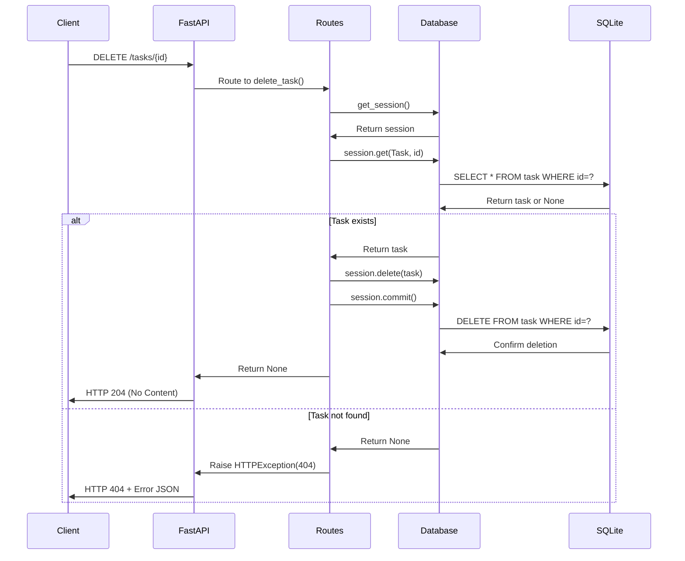
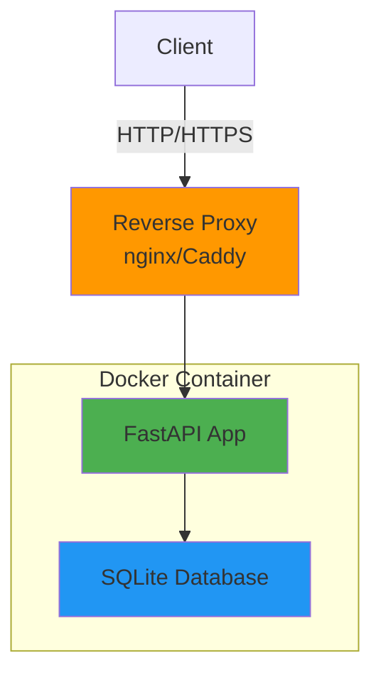

# Task Management App - System Architecture

## Overview

This document describes the system architecture for the Task Management App, a RESTful API-based task management application built with FastAPI and SQLite.

## Architecture Pattern

The application follows a **layered architecture** pattern with clear separation of concerns:

```
┌─────────────────────────────────────┐
│         API Layer (FastAPI)         │
│    (HTTP Request/Response Handling) │
└─────────────────────────────────────┘
                  ↓
┌─────────────────────────────────────┐
│         Routes Layer                │
│    (Endpoint Definitions & Routing) │
└─────────────────────────────────────┘
                  ↓
┌─────────────────────────────────────┐
│         Models Layer                │
│    (Data Validation & Schemas)      │
└─────────────────────────────────────┘
                  ↓
┌─────────────────────────────────────┐
│         Database Layer              │
│    (ORM & Data Persistence)         │
└─────────────────────────────────────┘
                  ↓
┌─────────────────────────────────────┐
│         SQLite Database             │
│    (Physical Data Storage)          │
└─────────────────────────────────────┘
```

## System Components

### 1. API Layer (`app/main.py`)

**Responsibilities:**
- Initialize the FastAPI application
- Configure application lifecycle (startup/shutdown)
- Register route handlers
- Provide health check endpoint
- Handle CORS and middleware configuration

**Key Features:**
- Lifespan context manager for database initialization
- Root endpoint for API health checks
- Router registration for task endpoints

### 2. Routes Layer (`app/routes.py`)

**Responsibilities:**
- Define RESTful API endpoints
- Handle HTTP request routing
- Manage request/response flow
- Inject database session dependencies
- Return appropriate HTTP status codes

**Endpoints:**
- `GET /tasks` - List all tasks
- `GET /tasks/{task_id}` - Get single task
- `POST /tasks` - Create new task
- `PUT /tasks/{task_id}` - Update task
- `DELETE /tasks/{task_id}` - Delete task

**Error Handling:**
- Returns 404 for non-existent tasks
- Returns 201 for successful creation
- Returns 204 for successful deletion
- Returns 200 for successful reads/updates

### 3. Models Layer (`app/models.py`)

**Responsibilities:**
- Define data structures and schemas
- Provide data validation
- Separate database models from API contracts
- Ensure type safety

**Models:**

**Task (Database Model):**
- `id`: Integer, primary key, auto-generated
- `title`: String, required, max 200 characters
- `description`: String, optional, nullable
- `is_completed`: Boolean, default False

**TaskCreate (Request Schema):**
- `title`: String, required
- `description`: String, optional

**TaskUpdate (Request Schema):**
- `title`: String, optional
- `description`: String, optional
- `is_completed`: Boolean, optional

### 4. Database Layer (`app/database.py`)

**Responsibilities:**
- Manage database connections
- Create database schema
- Provide session management
- Handle database lifecycle

**Key Functions:**
- `create_db_and_tables()`: Initialize database schema
- `get_session()`: Dependency injection for database sessions

**Technology:**
- SQLModel ORM (combines SQLAlchemy + Pydantic)
- SQLite database engine
- Session-based transaction management

### 5. Data Storage (SQLite)

**Responsibilities:**
- Persist task data
- Ensure data integrity
- Provide ACID transactions

**File:** `tasks.db` (created automatically)

## Project Structure

```
task-management-app/
├── app/
│   ├── __init__.py          # Package initialization
│   ├── main.py              # FastAPI application & lifecycle
│   ├── routes.py            # API endpoint definitions
│   ├── models.py            # Data models & schemas
│   └── database.py          # Database configuration & session
├── tests/
│   ├── __init__.py          # Test package initialization
│   └── test_tasks.py        # API endpoint tests
├── docs/
│   └── architecture.md      # This document
├── .github/
│   └── workflows/
│       └── ci.yml           # CI/CD pipeline
├── requirements.txt         # Python dependencies
├── Dockerfile              # Container configuration
├── README.md               # Project documentation
├── .gitignore              # Git ignore rules
├── .aider.conf.yml         # Aider configuration
└── tasks.db                # SQLite database (generated)
```

## Data Flow

### Create Task Flow



### Read Tasks Flow



### Update Task Flow



### Delete Task Flow



## Technology Stack

### Backend Framework
- **FastAPI**: Modern, fast web framework for building APIs
  - Automatic API documentation (Swagger/OpenAPI)
  - Built-in data validation with Pydantic
  - Async support (though not used in this simple app)
  - Dependency injection system

### Database & ORM
- **SQLite**: Lightweight, serverless database
  - Zero configuration
  - File-based storage
  - ACID compliant
  - Perfect for single-user applications

- **SQLModel**: SQL database ORM
  - Combines SQLAlchemy and Pydantic
  - Type hints and validation
  - Seamless integration with FastAPI
  - Automatic schema generation

### Testing
- **pytest**: Testing framework
- **TestClient**: FastAPI's built-in test client
- **In-memory SQLite**: Isolated test database

### Development Tools
- **uvicorn**: ASGI server for running FastAPI
- **Docker**: Containerization for deployment
- **GitHub Actions**: CI/CD pipeline

## Design Principles

### 1. Separation of Concerns
- Each layer has a single, well-defined responsibility
- Models are separated from business logic
- Database access is abstracted through sessions

### 2. Dependency Injection
- Database sessions are injected into route handlers
- Enables easy testing with mock dependencies
- Promotes loose coupling

### 3. Type Safety
- All models use Python type hints
- Pydantic validation ensures data integrity
- SQLModel provides compile-time type checking

### 4. RESTful Design
- Resources are identified by URLs
- HTTP methods map to CRUD operations
- Proper status codes for all responses
- Stateless communication

### 5. Testability
- Clear separation enables unit testing
- Dependency injection allows mocking
- In-memory database for fast tests
- Test fixtures for reusable setup

## Scalability Considerations

### Current Architecture
The current architecture is optimized for:
- Single-user scenarios
- Low to moderate traffic
- Simple CRUD operations
- Development and prototyping

### Future Enhancements
To scale the application, consider:

1. **Multi-user Support**
   - Add authentication/authorization layer
   - Implement user model and relationships
   - Add JWT token-based auth

2. **Database Migration**
   - Switch from SQLite to PostgreSQL/MySQL
   - Implement connection pooling
   - Add database migrations (Alembic)

3. **Caching Layer**
   - Add Redis for frequently accessed data
   - Implement cache invalidation strategy

4. **Service Layer**
   - Extract business logic from routes
   - Create service classes for complex operations
   - Enable better testing and reusability

5. **API Versioning**
   - Implement versioned endpoints (/v1/tasks)
   - Support backward compatibility

6. **Async Operations**
   - Leverage FastAPI's async capabilities
   - Use async database drivers
   - Improve concurrent request handling

## Security Considerations

### Current Implementation
- Input validation through Pydantic models
- SQL injection prevention via ORM
- Type safety through SQLModel

### Production Recommendations
- Add rate limiting
- Implement CORS properly
- Add request size limits
- Enable HTTPS only
- Add authentication/authorization
- Implement audit logging
- Add input sanitization
- Use environment variables for configuration

## Deployment Architecture



### Deployment Options

1. **Docker Container**
   - Self-contained environment
   - Easy deployment and scaling
   - Consistent across environments

2. **Cloud Platforms**
   - AWS (EC2, ECS, Lambda)
   - Google Cloud (Cloud Run, App Engine)
   - Azure (App Service, Container Instances)
   - Heroku, Railway, Render

3. **Reverse Proxy**
   - nginx or Caddy for production
   - SSL/TLS termination
   - Load balancing (if scaled)
   - Static file serving

## Monitoring & Observability

### Recommended Additions
- **Logging**: Structured logging with Python's logging module
- **Metrics**: Prometheus for application metrics
- **Tracing**: OpenTelemetry for distributed tracing
- **Health Checks**: Liveness and readiness endpoints
- **Error Tracking**: Sentry or similar service

## Conclusion

This architecture provides a solid foundation for a task management API with:
- Clear separation of concerns
- Easy testing and maintenance
- Type safety and validation
- RESTful design principles
- Room for future growth

The layered approach ensures that each component can be modified or replaced independently, making the system maintainable and extensible.
